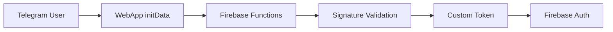

# 🎓 Augmentek LMS

> **Современная система управления обучением для Telegram WebApp**

[](https://flutter.dev)
[](https://firebase.google.com)
[](https://core.telegram.org/bots/webapps)
[](LICENSE)
[](https://augmentek-lms.web.app)

---

## 🌟 Введение

**Augmentek LMS** — это полнофункциональная система управления обучением, разработанная специально для экосистемы Telegram. Приложение сочетает в себе современные технологии Flutter и Firebase с нативной интеграцией Telegram WebApp.

### ✨ Ключевые особенности

- 🔐 **Seamless аутентификация** через Telegram без дополнительных регистраций
- 👥 **Ролевая модель**: студенты и администраторы с разными правами доступа
- 📚 **Полный цикл обучения**: курсы → разделы → уроки → домашние задания
- 📱 **Нативный UX** для Telegram WebApp с адаптивным дизайном
- 🎨 **Material 3** дизайн с персиковой цветовой схемой Augmentek
- 🔍 **Визуальная система отладки** (нет доступа к консоли в Telegram)

---

## 🚀 Live Demo

### 🔗 Доступ к приложению
- **Telegram WebApp**: t.me/augmentek_bot

---

## 📱 Функциональность

### 🎓 Для студентов

- **Персональная панель** с прогрессом обучения
- **Каталог курсов** с поиском и фильтрацией  
- **Запись на курсы** в один клик
- **Прохождение уроков** с поддержкой видео и Markdown
- **Домашние задания** с загрузкой файлов и получением обратной связи
- **Отслеживание прогресса** по курсам и урокам

### 👨‍🏫 Для администраторов

- **Админ-панель** с полным управлением системой
- **Управление пользователями**: просмотр профилей, назначение прав
- **Создание контента**: курсы, разделы, уроки с rich-text редактором
- **Система проверки заданий** с комментариями и статусами
- **Загрузка медиа**: обложки курсов, документы, видео
- **Аналитика**: статистика пользователей и активности

---

## 🏗️ Техническая архитектура

### 🛠️ Технологический стек

```
Frontend:  Flutter Web + Riverpod + GoRouter + Material 3
Backend:   Firebase (Functions + Firestore + Storage + Hosting)
Auth:      Custom Firebase Auth + Telegram WebApp initData
UI/UX:     Telegram WebApp native integration
```

### 📊 База данных (Firestore)

```
Collections:
├── users/              # Профили пользователей с прогрессом
├── courses/            # Курсы с метаданными
├── sections/           # Разделы курсов  
├── lessons/            # Уроки с контентом и заданиями
├── homework_submissions/ # Домашние задания со статусами
└── admins/             # Список администраторов системы
```

### 🔧 Архитектурные паттерны

- **Repository Pattern** для абстракции данных
- **Provider Pattern** (Riverpod) для управления состоянием
- **Dependency Injection** для слабой связанности компонентов
- **Feature-based** структура папок для масштабируемости

---

## 🚀 Быстрый старт

### 1️⃣ Клонирование репозитория

```bash
git clone https://github.com/your-username/augmentek-lms.git
cd augmentek-lms
```

### 2️⃣ Установка зависимостей

```bash
flutter pub get
cd functions && npm install
```

### 3️⃣ Конфигурация Firebase

```bash
# Создайте проект в Firebase Console
firebase login
firebase use --add your-project-id

# Настройте окружение
firebase functions:secrets:set BOT_TOKEN
# Добавьте ваш Telegram Bot Token
```

### 4️⃣ Запуск в режиме разработки

```bash
# Локальный запуск (веб-версия)
flutter run -d chrome

# Деплой на Firebase
flutter build web
firebase deploy
```

### 5️⃣ Настройка Telegram Bot

```bash
# Установка webhook для вашего бота
curl -X POST \
  "https://api.telegram.org/bot<BOT_TOKEN>/setWebhook" \
  -H "Content-Type: application/json" \
  -d '{"url": "https://your-project.web.app"}'
```

---

## 📚 Telegram Bot

### 🤖 Возможности бота

- 📄 **Уведомления** о новых заданиях и результатах проверки
- 📎 **Загрузка файлов** для домашних заданий через бота
- 📊 **Статистика обучения** и прогресс по курсам
- 🚀 **Быстрый доступ** к WebApp через команды

### ⚙️ Основные команды

```
/start    - Регистрация и приветствие
/homework - Список активных заданий  
/progress - Статистика обучения
/settings - Настройки уведомлений
/help     - Справка по командам
```

### 📁 Поддерживаемые файлы

- 📄 Документы: PDF, DOC, DOCX, TXT
- 🖼 Изображения: JPG, PNG, GIF  
- 🎵 Аудио: MP3, WAV, M4A
- 🎥 Видео: MP4, MOV, AVI
- 🎤 Голосовые сообщения

**Ограничение**: максимум 20 МБ на файл

---

## 🧪 Тестирование

### 🔍 Как протестировать

1. **Откройте** [augmentek-lms.web.app](https://augmentek-lms.web.app) в браузере
2. **Или настройте** Telegram Bot WebApp (см. инструкции выше)
3. **Войдите** используя Telegram аутентификацию
4. **Протестируйте** функции согласно чек-листу ниже

### ✅ Чек-лист тестирования

#### Базовая функциональность
- [ ] Автоматический вход через Telegram
- [ ] Навигация по главному экрану с bottom navigation
- [ ] Переключение между вкладками "За парту" / "В коридор"
- [ ] Отображение профиля пользователя

#### Функции студента  
- [ ] Просмотр каталога курсов
- [ ] Запись на курс
- [ ] Прохождение уроков
- [ ] Выполнение домашних заданий

#### Функции администратора (ID: 142170313)
- [ ] Доступ к админ-панели
- [ ] Создание курсов с обложками
- [ ] Управление пользователями
- [ ] Проверка домашних заданий

#### Техническое тестирование
- [ ] Responsive дизайн на мобильных устройствах
- [ ] Работа системы логирования (floating debug button)
- [ ] Загрузка и сохранение файлов
- [ ] Навигация назад/вперед

---

## 📋 Структура проекта

```
miniapp/
├── lib/
│   ├── core/                   # Ядро приложения
│   │   ├── config/            # Конфигурация и константы
│   │   ├── di/                # Dependency Injection
│   │   ├── error/             # Обработка ошибок
│   │   ├── theme/             # Дизайн система
│   │   └── utils/             # Утилиты и хелперы
│   ├── features/              # Функциональные модули
│   │   ├── auth/              # Аутентификация
│   │   ├── admin/             # Админ-панель
│   │   ├── course/            # Управление курсами
│   │   ├── student/           # Студенческий интерфейс
│   │   └── home/              # Главный экран
│   ├── shared/                # Общие компоненты
│   │   ├── models/            # Модели данных (Freezed)
│   │   └── widgets/           # Переиспользуемые виджеты
│   └── main.dart              # Точка входа
├── functions/                 # Firebase Functions
├── docs/                      # Документация
├── web/                       # Web-специфичные файлы
└── test/                      # Тесты (планируется)
```

---

## 🔧 Конфигурация

### 🔑 Переменные окружения

```bash
# Firebase конфигурация
FIREBASE_PROJECT_ID=your-project-id
FIREBASE_API_KEY=your-api-key

# Telegram Bot
BOT_TOKEN=your-bot-token

# Окружение
ENVIRONMENT=development|staging|production
```

### 👨‍💼 Настройка администраторов

```dart
// lib/core/config/admin_config.dart
class AdminConfig {
  static const List<int> adminIds = [
    142170313, // Ваш Telegram ID
    // Добавьте другие ID администраторов
  ];
}
```

---

## 🗺️ Roadmap

### 🔄 Текущий этап: Рефакторинг (v1.1.0)
- [ ] Замена `print()` на визуальное логирование
- [ ] Создание системы unit/widget тестов  
- [ ] Оптимизация производительности и кэширование
- [ ] Улучшение error handling для production

### 🚀 Следующие релизы

#### v1.2.0 - Расширенные возможности
- [ ] Система квизов и тестирования
- [ ] Групповые задания и коллаборация
- [ ] Детальная аналитика обучения
- [ ] Сертификация и achievements

#### v1.3.0 - Масштабирование  
- [ ] Многоязычность (i18n)
- [ ] Темная тема
- [ ] Offline-first архитектура
- [ ] Интеграция с внешними LMS

#### v2.0.0 - Экосистема
- [ ] Мобильные приложения (iOS/Android)
- [ ] API для интеграций
- [ ] Marketplace курсов
- [ ] AI-powered персонализация

---

## 🤝 Участие в разработке

Мы приветствуем участие в развитии проекта! 

### 📋 Как помочь

1. **Fork** репозитория
2. **Создайте** feature branch (`git checkout -b feature/amazing-feature`)
3. **Commit** изменения (`git commit -m 'Add amazing feature'`)
4. **Push** в branch (`git push origin feature/amazing-feature`)
5. **Откройте** Pull Request

### 📝 Правила участия

- Следуйте [style guide](docs/DOCUMENTATION_RULES.md)
- Покрывайте новый код тестами
- Обновляйте документацию при необходимости
- Используйте conventional commits

---

## 📚 Документация

### 📖 Дополнительная информация

- [📋 Plan рефакторинга](docs/REFACTORING_PLAN.md) - детальный план технических улучшений
- [🏗️ Архитектура системы](docs/SYSTEM_ONTOLOGY.md) - техническая документация
- [📊 Текущее состояние](docs/CURRENT_STATE.md) - статус разработки
- [🎯 План развития](docs/DEVELOPMENT_PLAN.md) - roadmap проекта
- [📱 Экраны приложения](docs/APP_SCREENS.md) - UX документация
- [📝 Правила документирования](docs/DOCUMENTATION_RULES.md) - стандарты команды

### 🛠️ Техническая документация

- [🔥 Firebase настройка](docs/firebase-setup.md)
- [🤖 Telegram Bot конфигурация](docs/telegram-bot-setup.md)
- [🧪 Руководство по тестированию](docs/testing-guide.md)
- [🚀 Deployment инструкции](docs/deployment.md)

---

## ⚡ Performance

### 📊 Метрики

- **Время загрузки**: < 2 секунды на 3G
- **Bundle size**: оптимизирован для web
- **Firestore запросы**: кэшированы с составными индексами
- **Responsive**: поддержка всех размеров экранов

### 🔧 Оптимизации

- Tree-shaking для минимизации bundle size
- Lazy loading для тяжелых экранов
- Image optimization для обложек курсов
- Offline-ready архитектура (в планах)

---

## 🔒 Безопасность

### 🛡️ Меры защиты

- **Firebase Rules** с проверкой прав доступа
- **Валидация Telegram initData** через cryptographic signature
- **XSS/CSRF защита** благодаря Flutter Web
- **Encrypted storage** для sensitive данных

### 🔑 Аутентификация



---

## 📄 Лицензия

Этот проект лицензирован под **MIT License** - см. [LICENSE](LICENSE) файл для деталей.

---

## 🙏 Благодарности

- **Flutter Team** за отличный фреймворк
- **Firebase** за powerful backend-as-a-service
- **Telegram** за открытые WebApp возможности
- **Community** за вклад в развитие проекта

---

## 📞 Поддержка

### 🐛 Нашли баг?
Создайте [issue](https://github.com/your-username/augmentek-lms/issues) с подробным описанием

### 💡 Есть идея?
Обсудите в [discussions](https://github.com/your-username/augmentek-lms/discussions)

### 📧 Контакты
- **Email**: info@augmentek.com
- **Telegram**: @pionmedvedeva

---

<div align="center">

**🎓 Augmentek LMS** - Поддержка развития естественного интеллекта

[🚀 Live Demo](https://t.me/augmentek_bot) • [📚 Documentation](docs/) • [🐛 Issues](issues) • [💡 Discussions](discussions)

</div>