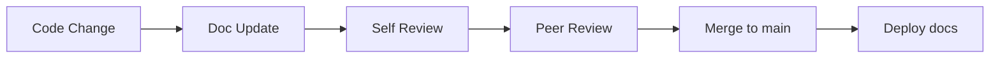

# 📝 Правила документирования - Augmentek LMS

> **Стандарты создания, поддержки и обновления документации проекта**

---

## 🎯 Принципы документирования

### 1. **Документация как код**
- Документация является частью кодовой базы
- Обновляется вместе с изменениями в коде
- Проходит review процесс как обычный код
- Версионируется вместе с релизами

### 2. **Пользователь-центричность**
- Пишем для конкретной аудитории (разработчики, тестировщики, пользователи)
- Фокус на решении задач пользователя
- Примеры из реальной практики
- Step-by-step инструкции

### 3. **Актуальность и достоверность**
- Документация должна отражать текущее состояние системы
- Устаревшие разделы помечаются как deprecated
- Регулярные проверки на соответствие коду
- Automated tests для документации когда возможно

---

## 📚 Структура документации

### 🔄 Иерархия документов

```
docs/
├── README.md                    # Главная страница проекта
├── CHANGELOG.md                 # История изменений
├── CONTRIBUTING.md              # Правила участия в проекте
├── 
├── technical/                   # Техническая документация
│   ├── architecture.md         # Архитектура системы
│   ├── api-reference.md        # API документация
│   ├── database-schema.md      # Схема базы данных
│   └── deployment.md           # Инструкции по деплою
├── 
├── user-guides/                # Пользовательские руководства
│   ├── admin-guide.md          # Руководство администратора
│   ├── student-guide.md        # Руководство студента
│   └── telegram-bot-setup.md   # Настройка Telegram Bot
├── 
├── development/                # Документация для разработчиков
│   ├── getting-started.md      # Быстрый старт
│   ├── coding-standards.md     # Стандарты кодирования
│   ├── testing-guide.md        # Руководство по тестированию
│   └── troubleshooting.md      # Решение проблем
└── 
└── meta/                       # Мета-документация
    ├── DOCUMENTATION_RULES.md  # Этот файл
    └── templates/              # Шаблоны документов
```

### 📋 Типы документов

| Тип | Аудитория | Цель | Обновление |
|-----|-----------|------|------------|
| **README** | Все | Первое впечатление, quick start | С каждым major релизом |
| **Technical Docs** | Разработчики | Понимание архитектуры | С изменениями в коде |
| **User Guides** | Конечные пользователи | Решение задач | С изменениями в UI/UX |
| **API Docs** | Интеграторы | Reference материалы | Автоматически из кода |
| **Changelog** | Все | История изменений | С каждым релизом |

---

## ✍️ Стандарты написания

### 📝 Стиль и тон

- **Активный залог** вместо пассивного
- **Простые предложения** без сложных конструкций
- **Конкретные примеры** вместо абстрактных описаний
- **Дружелюбный, но профессиональный** тон
- **Избегаем жаргона** без объяснений

### 🎨 Форматирование

#### Заголовки
```markdown
# H1 - Название документа (один на документ)
## H2 - Основные разделы  
### H3 - Подразделы
#### H4 - Детали (максимум)
```

#### Эмодзи в заголовках
```markdown
# 🚀 Getting Started
## 🔧 Configuration  
### ⚙️ Environment Setup
```

#### Блоки кода
```markdown
# Именованные блоки с языком
```dart
class Example {
  // Код с комментариями
}
```

# Команды терминала с комментариями  
```bash
# Установка зависимостей
flutter pub get
```

# Конфигурационные файлы
```yaml
# pubspec.yaml
dependencies:
  flutter: sdk
```
```

#### Списки и таблицы
```markdown
# Маркированные списки для неупорядоченной информации
- Первый пункт
- Второй пункт
  - Подпункт с отступом

# Нумерованные списки для последовательных шагов
1. Первый шаг
2. Второй шаг
3. Третий шаг

# Таблицы для структурированных данных
| Параметр | Тип | Описание |
|----------|-----|----------|
| `id` | String | Уникальный идентификатор |
```

### 🔗 Ссылки и references

```markdown
# Внутренние ссылки на разделы
См. раздел [Настройка](#настройка)

# Ссылки на другие документы
Подробнее в [Testing Guide](testing-guide.md)

# Ссылки на код
Проверьте файл [`lib/main.dart`](../lib/main.dart)

# Внешние ссылки
[Flutter Documentation](https://flutter.dev/docs)
```

---

## 🔄 Процесс обновления документации

### 📋 Когда обновлять

| Событие | Действие | Ответственный |
|---------|----------|---------------|
| **Новая функция** | Добавить в user guide + API docs | Feature developer |
| **Breaking change** | Обновить migration guide | Lead developer |
| **UI изменения** | Обновить скриншоты | UI developer |
| **Bug fix** | Обновить troubleshooting если нужно | Bug fixer |
| **Релиз** | Обновить CHANGELOG | Release manager |

### 🔍 Review процесс



### ✅ Чек-лист перед commit

- [ ] **Орфография и грамматика** проверены
- [ ] **Ссылки** работают корректно
- [ ] **Скриншоты** актуальны (если есть)
- [ ] **Примеры кода** запускаются
- [ ] **Версии** зависимостей совпадают с кодом
- [ ] **TOC** (Table of Contents) обновлен

---

## 🛠️ Инструменты и автоматизация

### 📖 Генерация документации

```bash
# API документация из кода (Dart)
dart doc

# Диаграммы архитектуры (Mermaid)
# Встроены в GitHub Markdown

# Конвертация Markdown в другие форматы
pandoc README.md -o README.pdf
```

### 🔗 Автоматические проверки

```yaml
# .github/workflows/docs.yml
name: Documentation Check
on: [push, pull_request]
jobs:
  docs-lint:
    runs-on: ubuntu-latest
    steps:
      - uses: actions/checkout@v3
      - name: Lint markdown
        run: markdownlint docs/
      - name: Check links
        run: markdown-link-check docs/**/*.md
      - name: Spell check
        run: cspell "docs/**/*.md"
```

### 📊 Метрики качества документации

- **Coverage**: % API endpoints с документацией
- **Freshness**: время с последнего обновления
- **Accuracy**: % working links и примеров
- **Completeness**: отсутствующие разделы

---

## 📱 Специфика для Telegram WebApp

### 🔍 Особенности отладки

```markdown
# ❌ Неправильно (консоль недоступна)
Откройте Developer Tools и посмотрите в консоль

# ✅ Правильно  
Нажмите на плавающую кнопку Debug в правом нижнем углу
```

### 📱 Скриншоты и демо

- **Скриншоты** делаем в Telegram WebApp, не в браузере
- **Разрешение** оптимизируем для мобильных устройств
- **Темы** показываем в светлой теме Telegram
- **Annotations** добавляем стрелки и подписи

### 🔧 Ограничения платформы

```markdown
# Документируем ограничения явно
> ⚠️ **Ограничение Telegram WebApp**: SVG аватары не поддерживаются.
> Используется fallback на инициалы пользователя.
```

---

## 📋 Шаблоны документов

### 🚀 Шаблон Feature документации

```markdown
# 🎯 Название функции

## Описание
Краткое описание функции и её ценности для пользователя.

## Для кого
- **Студенты**: как это помогает в обучении
- **Администраторы**: как это упрощает управление

## Как использовать

### Шаг 1: Подготовка
Описание подготовительных действий

### Шаг 2: Основные действия  
1. Конкретные шаги
2. С примерами
3. И скриншотами

### Шаг 3: Результат
Что ожидать в итоге

## Troubleshooting

| Проблема | Причина | Решение |
|----------|---------|---------|
| Конкретная ошибка | Вероятная причина | Шаги решения |

## API Reference (если применимо)
```dart
// Примеры кода с комментариями
```

## См. также
- Ссылки на связанные документы
- Внешние ресурсы
```

### 🐛 Шаблон Troubleshooting

```markdown
# 🔧 Решение проблемы: Название

## Симптомы
- Что видит пользователь
- Сообщения об ошибках
- Скриншоты ошибок

## Причины
Возможные причины возникновения

## Решение

### Быстрое решение
Для срочного исправления

### Полное решение  
Для устранения корневой причины

## Предотвращение
Как избежать повторения

## Связанные проблемы
Ссылки на похожие кейсы
```

### 📊 Шаблон Release Notes

```markdown
# 📦 Релиз v1.2.0 - Название релиза

## 🎯 Основные изменения
- **Новая функция**: описание пользы
- **Улучшение**: что стало лучше
- **Исправление**: что работало неправильно

## ✨ Новые возможности

### Для студентов
- Список новых возможностей
- С примерами использования

### Для администраторов  
- Новые инструменты управления
- Расширенная аналитика

## 🔧 Технические изменения
- Обновления зависимостей
- Изменения в API
- Требования к окружению

## 🚀 Инструкции по обновлению
1. Шаги для обновления
2. Миграция данных (если нужна)
3. Проверка работоспособности

## ⚠️ Breaking Changes
- Описание критических изменений
- Инструкции по адаптации кода

## 🐛 Исправленные баги
- Список исправленных проблем
- Ссылки на issue в GitHub
```

---

## 📈 KPI документации

### 🎯 Метрики качества

| Метрика | Цель | Измерение |
|---------|------|-----------|
| **API Coverage** | 90%+ | Автоматически из кода |
| **Link Health** | 95%+ | CI проверки |
| **User Satisfaction** | 4.5/5 | Опросы пользователей |
| **Time to First Success** | <5 мин | Метрики пользователей |

### 📊 Регулярный аудит

```markdown
# Ежемесячный чек-лист
- [ ] Проверить все external links
- [ ] Обновить скриншоты UI
- [ ] Синхронизировать с latest code
- [ ] Собрать feedback от пользователей
- [ ] Обновить metrics dashboard
```

---

## 🤝 Коллаборация

### 👥 Роли и ответственности

| Роль | Ответственность |
|------|----------------|
| **Product Owner** | Пользовательские guides и требования |
| **Lead Developer** | Архитектурная документация |
| **Feature Developer** | API docs и implementation guides |
| **QA Engineer** | Testing guides и troubleshooting |
| **Tech Writer** | Редактирование и стиль |

### 💬 Каналы обратной связи

- **GitHub Issues** с лейблом `documentation`
- **Slack/Telegram** канал #docs для быстрых вопросов
- **Ежемесячные ретро** по качеству документации
- **User interviews** для понимания боли

### 📝 Процесс предложений

1. **Issue** с описанием проблемы/предложения
2. **Discussion** с командой
3. **RFC** для крупных изменений
4. **Implementation** + review
5. **Deployment** и мониторинг usage

---

## 🔮 Будущее документации

### 🤖 Автоматизация

- **AI-powered** генерация примеров из кода
- **Automated screenshots** при изменениях UI
- **Smart suggestions** для обновлений
- **Interactive tutorials** вместо статичных guides

### 📱 Интерактивность

- **Live code examples** прямо в документации
- **Embedded demos** Telegram WebApp
- **Step-by-step wizards** для сложных процессов
- **Video tutorials** для визуальных learners

### 🌍 Локализация

- **Multi-language** поддержка (EN/RU)
- **Cultural adaptation** примеров
- **Regional compliance** requirements
- **Community translations**

---

## ✅ Action Items

### 🎯 Немедленные действия

- [ ] Создать templates в `docs/templates/`
- [ ] Настроить CI для проверки документации
- [ ] Установить markdownlint и cspell
- [ ] Создать документацию по архитектуре

### 📅 В течение месяца

- [ ] Аудит существующей документации
- [ ] Интервью с пользователями
- [ ] Метрики качества документации
- [ ] Training для команды

### 🚀 Долгосрочные цели

- [ ] Интерактивная документация
- [ ] Автоматизация скриншотов
- [ ] AI-powered suggestions
- [ ] Community contributions

---

**📝 Хорошая документация - это инвестиция в будущее проекта!**

Следуйте этим правилам для создания документации мирового класса, которая действительно помогает пользователям и разработчикам. 