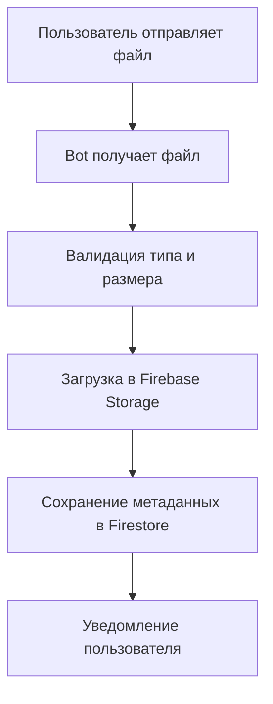

# 🤖 Telegram Bot - Техническая документация

## 📋 Обзор

Telegram бот для **Augmentek LMS** предоставляет расширенные возможности взаимодействия с системой обучения через мессенджер:

- 📚 Уведомления о новых заданиях и результатах проверки
- 📎 Загрузка файлов к домашним заданиям
- 📊 Статистика обучения и прогресса
- 🚀 Быстрый доступ к LMS WebApp

---

## 🛠 Техническая архитектура

### Технологический стек
- **Фреймворк**: grammY (современная библиотека для Telegram Bot API)
- **Хостинг**: Firebase Cloud Functions
- **База данных**: Firestore для хранения данных пользователей
- **Файлы**: Firebase Storage для хранения загруженных документов
- **Уведомления**: Firestore Triggers для real-time оповещений

### Cloud Functions
```typescript
// Основные функции
functions/src/
├── bot-trigger.ts          # Основной webhook endpoint
├── auth.ts                 # Аутентификация через Telegram initData
├── setup-webhook.ts        # Настройка webhook автоматически
└── index.ts               # Экспорт всех функций
```

---

## ⚙️ Настройка и конфигурация

### 1. Создание Telegram Bot

```bash
# 1. Создайте бота через @BotFather
/newbot
# Следуйте инструкциям для создания бота

# 2. Получите Bot Token
# Сохраните токен для дальнейшего использования
```

### 2. Конфигурация Firebase

```bash
# Добавьте секрет с токеном бота
firebase functions:secrets:set BOT_TOKEN

# При вводе укажите токен, полученный от @BotFather
```

### 3. Настройка WebApp

```bash
# В @BotFather настройте WebApp
/setmenubutton

# Bot: @YourBot
# Button text: 🎓 Открыть LMS
# WebApp URL: https://augmentek-lms.web.app
```

### 4. Деплой Functions

```bash
cd functions
npm install
firebase deploy --only functions
```

### 5. Настройка Webhook

```bash
# Получите URL функции после деплоя
# Обычно: https://us-central1-PROJECT_ID.cloudfunctions.net/telegramBot

# Установите webhook
curl -X POST \
  "https://api.telegram.org/bot<BOT_TOKEN>/setWebhook" \
  -H "Content-Type: application/json" \
  -d '{
    "url": "https://us-central1-augmentek-lms.cloudfunctions.net/telegramBot"
  }'
```

---

## 💬 Команды бота

### Основные команды

| Команда | Описание | Доступность |
|---------|----------|-------------|
| `/start` | Приветствие и регистрация пользователя | Все |
| `/homework` | Список активных домашних заданий | Студенты |
| `/progress` | Статистика обучения | Студенты |
| `/settings` | Настройки уведомлений | Все |
| `/help` | Справка по всем командам | Все |
| `/admin` | Админ-панель (скоро) | Администраторы |

### Интеграция с WebApp

Все команды содержат inline кнопки для перехода в WebApp:

```typescript
// Пример кнопки для команды /homework
const keyboard = {
  inline_keyboard: [[
    {
      text: "🚀 Открыть LMS",
      web_app: { url: "https://augmentek-lms.web.app" }
    }
  ]]
};
```

---

## 📁 Система загрузки файлов

### Поддерживаемые форматы

| Тип | Форматы | Максимальный размер |
|-----|---------|-------------------|
| 📄 Документы | PDF, DOC, DOCX, TXT | 20 МБ |
| 🖼 Изображения | JPG, PNG, GIF, WEBP | 20 МБ |
| 🎵 Аудио | MP3, WAV, M4A, OGG | 20 МБ |
| 🎥 Видео | MP4, MOV, AVI, WEBM | 20 МБ |
| 🎤 Голосовые | OGA, OPUS | 20 МБ |

### Процесс загрузки



### Код обработки файлов

```typescript
// Упрощенный пример обработки файлов
bot.on("document", async (ctx) => {
  const file = ctx.message.document;
  
  // Валидация
  if (file.file_size > 20 * 1024 * 1024) {
    return ctx.reply("❌ Файл слишком большой (макс. 20 МБ)");
  }
  
  // Загрузка в Storage
  const fileUrl = await uploadToFirebaseStorage(file);
  
  // Сохранение в Firestore
  await saveHomeworkSubmission(ctx.from.id, fileUrl);
  
  ctx.reply("✅ Файл успешно загружен!");
});
```

---

## 🔔 Система уведомлений

### Для студентов

```typescript
// Уведомление о результате проверки домашнего задания
export const notifyHomeworkReviewed = functions.firestore
  .document('homework_submissions/{submissionId}')
  .onUpdate(async (change, context) => {
    const newData = change.after.data();
    const oldData = change.before.data();
    
    // Проверяем изменение статуса
    if (oldData.status !== newData.status && newData.status !== 'pending') {
      await sendNotificationToStudent(newData.studentId, newData);
    }
  });
```

### Для администраторов

```typescript
// Уведомление о новом домашнем задании
export const notifyNewHomework = functions.firestore
  .document('homework_submissions/{submissionId}')
  .onCreate(async (snapshot, context) => {
    const submission = snapshot.data();
    await sendNotificationToAdmins(submission);
  });
```

### Типы уведомлений

| Событие | Получатель | Шаблон сообщения |
|---------|------------|------------------|
| Новое задание | Администраторы | "📚 Новое задание от {student}" |
| Задание проверено | Студент | "✅ Ваше задание проверено: {status}" |
| Комментарий к заданию | Студент | "💬 Преподаватель оставил комментарий" |
| Еженедельная статистика | Администраторы | "📊 Статистика за неделю" |

---

## 🔐 Безопасность

### Валидация пользователей

```typescript
// Проверка прав доступа
const isAdmin = await checkUserRole(ctx.from.id);
if (command.adminOnly && !isAdmin) {
  return ctx.reply("❌ Недостаточно прав для выполнения команды");
}
```

### Защита от спама

```typescript
// Rate limiting для команд
const rateLimiter = new Map();

bot.use(async (ctx, next) => {
  const userId = ctx.from.id;
  const now = Date.now();
  const lastCommand = rateLimiter.get(userId) || 0;
  
  if (now - lastCommand < 1000) { // 1 секунда между командами
    return ctx.reply("⏰ Слишком частые команды, подождите немного");
  }
  
  rateLimiter.set(userId, now);
  await next();
});
```

### Логирование действий

```typescript
// Логирование всех операций
bot.use(async (ctx, next) => {
  console.log(`[${new Date().toISOString()}] ${ctx.from.id}: ${ctx.message?.text}`);
  await next();
});
```

---

## 📈 Мониторинг и отладка

### Firebase Functions Logs

```bash
# Просмотр логов в реальном времени
firebase functions:log --only telegramBot

# Фильтрация по типу логов
firebase functions:log --only telegramBot | grep ERROR
```

### Webhook статус

```bash
# Проверка статуса webhook
curl https://api.telegram.org/bot<BOT_TOKEN>/getWebhookInfo

# Удаление webhook (для локальной разработки)
curl -X POST https://api.telegram.org/bot<BOT_TOKEN>/deleteWebhook
```

### Получение информации о боте

```bash
# Информация о боте
curl https://api.telegram.org/bot<BOT_TOKEN>/getMe

# Список команд
curl https://api.telegram.org/bot<BOT_TOKEN>/getMyCommands
```

---

## 🔧 Локальная разработка

### Настройка локального окружения

```bash
# 1. Установка Firebase CLI
npm install -g firebase-tools

# 2. Клонирование репозитория
git clone <repo-url>
cd miniapp/functions

# 3. Установка зависимостей
npm install

# 4. Настройка переменных окружения
echo "BOT_TOKEN=your_bot_token" > .env

# 5. Запуск эмулятора Functions
firebase emulators:start --only functions
```

### Тестирование webhook локально

```bash
# Установка ngrok для туннелирования
npm install -g ngrok

# Создание туннеля к локальному серверу
ngrok http 5001

# Обновление webhook на ngrok URL
curl -X POST \
  "https://api.telegram.org/bot<BOT_TOKEN>/setWebhook" \
  -d "url=https://your-ngrok-url.ngrok.io/PROJECT_ID/us-central1/telegramBot"
```

---

## ✨ Планы развития

### v1.2.0 - Расширенные возможности

- [ ] **Inline квизы** прямо в чате
- [ ] **Групповые задания** с коллаборацией
- [ ] **Push уведомления** для важных событий
- [ ] **Интеграция с календарем** для дедлайнов

### v1.3.0 - Аналитика и AI

- [ ] **Детальная аналитика** активности пользователей
- [ ] **AI-powered рекомендации** курсов
- [ ] **Chatbot помощник** для ответов на вопросы
- [ ] **Автоматическая модерация** контента

### v2.0.0 - Экосистема

- [ ] **Multi-bot поддержка** для разных организаций
- [ ] **API для интеграций** с внешними системами
- [ ] **Marketplace** курсов и материалов
- [ ] **Blockchain сертификация** достижений

---

## 🐛 Устранение неполадок

### Частые проблемы

| Проблема | Причина | Решение |
|----------|---------|---------|
| Bot не отвечает | Webhook не настроен | Проверить webhook статус |
| Файлы не загружаются | Превышен размер | Проверить ограничения |
| Уведомления не приходят | Ошибка в triggers | Проверить Functions logs |
| Команды не работают | Права доступа | Проверить роль пользователя |

### Отладка

```bash
# Проверка webhook
curl https://api.telegram.org/bot<BOT_TOKEN>/getWebhookInfo

# Проверка последних обновлений
curl https://api.telegram.org/bot<BOT_TOKEN>/getUpdates

# Очистка pending updates
curl https://api.telegram.org/bot<BOT_TOKEN>/getUpdates?offset=-1
```

---

**🤖 Telegram Bot** готов к работе! Используйте `/start` для начала взаимодействия с системой. 